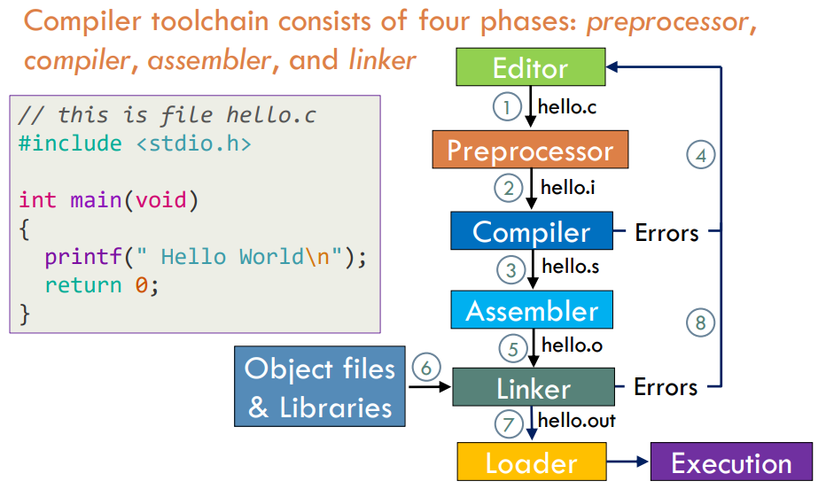
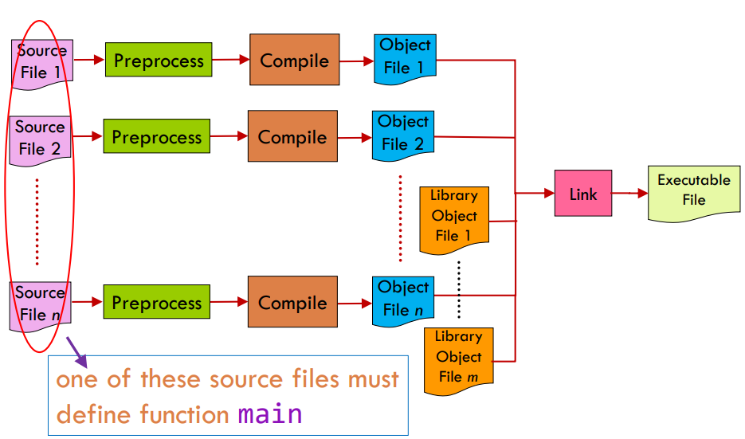

# C/C++ Compiler Toolchain



## Preprocessor

At the top level, the programmer writes and creates a **source file** or a `.c` file where all code is stored. In C++, this source file becomes a `.cpp` file. When we compile the source file, it is first submitted to the preprocessor for code substitutions. The **preprocessor** will replace `#include` codes with code from the header file and macros defined by `#define`. After substituting the codes, the preprocessor generates the `.i` file. This is also called **translation**. Basically, after translation, each individual file is now known as a **translation unit**.

## Compiler

The `.i` file contains substituted code written in the source language which is further submitted to the **compiler**. The compiler will then finally compile the code and ensure that there are no errors. Once it has finished checking, it will convert the `.i` file into a `.s` file which consists of code written in assembly.


## Assembler & Linker

The `.s` file is then passed to the **assembler **for further processing which converts the `.s` file into `.o` file. The `.o` file is an incomplete object file as it does not contain references to external subroutines and therefore cannot be executed directly by the operating system. When we execute a program for the first time, the .o file is passed through a linker which performs linking and generates a linked version of the program and writes it into an executable file or a `.exe` file. It will link other files with other files to create the final executable file.

Therefore without linking the math library and attempting to create an executable that includes `<math.h>`, you will get a linker error. To solve this, you will need to search for the math library and ensure it links to that file. You can do this through

```cpp
gcc sin.o - sin,out -lm
```

## Libraries

### Static Library

The other files mentioned earlier are commonly known as **library files**. There are two types of library files. A library is a collection of precompiled object files which can be linked into programs. Libraries are typically stored in special archive files with extension `.a` , referred to as **static libraries**. They are created from object files with a separate tool, the GNU archiver ar , and used by the linker to resolve references to functions at compile-time. In C, the math portion of the C standard library is stored in a separate static library. This is for some historical reasons. The functions in the math library are declared in header file `<math.h>`.However, again for historical reasons, gcc does not automatically link libm.a.

### DLL

The second type is called a **Dynamic Linked Library**. DLLs go through the same compilation process as well but they do not go through the linker. The operating system will run the DLL together with the exe. When the exe requires a function from the DLL, it will make a request to the operating system and it will get it from the DLL. The DLL is made so that the DLL doesn't have to be recompiled together with the exe. They can exist separately.

The executable file is a complete object file with references to external subroutines and linkage to all sorts of dlls. Executable files are different for each type of CPU. For example, the output executable file for a 32 bit or 64 bit processor is different. The compiler needs to know which executable file to build for as the machine code for each processor is different. The executable files can be executed directly by the operating system.

## Loader

The final step of this process is to load the executable file into main memory so that the program can run. The loader is in charge of this process. After loading the executable file into main memory, the program can finally run.



# PHASES OF TRANSLATION

### Tokenizing and Parsing

(SECTION STILL IN PROGRESS)

It converts into a format that the compiler understands. Compilers only have 2 jobs, storing constant data and creating a set of instructions. Creates an abstract syntax tree, a representation of our code in the file of the tree. Upon creating this tree, it is going to generate the machine code and a place to store all the variables.. C++ does not care about files, a file is just a way to feed the compiler with source code. The programmer needs to declare what kind of file it is and how the compiler should care about it. Every cpp file will go through a phase called translation where at the end it becomes a translation unit.

[Phases of translation - cppreference.com](https://en.cppreference.com/w/cpp/language/translation_phases)

Lexical analysis: This is the initial part of the reading and analysing the program text in stats-driver.i. The text is read and divided into tokens (read about tokens on pages 27-29 of the text), each of which corresponds to a symbol in the C programming language, e.g., a variable name, keyword, a function name, or number. 

Syntax analysis: This phase - also called parsing - takes the list of tokens produced by the lexical analysis and arranges them in a tree-like structure called the syntax tree that reflects the structure of the program. 

Type checking: This phase analyzes the syntax tree to determine if the program violates certain consistency requirements, e.g., if a variable is used but not declared or if it is used in a context that doesn't make sense given the type of the variable, such as using a function that returns nothing as an operand of the addition operator. 

Assembly code generation: The program is translated to assembly language for a specific machine architecture

# Compilers

Two popular compilers are the GNU and Clang Compilers. When installing GNU compilers, you would need to install both GCC and G++ compilers. The difference is listed in the table below. GCC is used as it is free, able to compile a number of languages, runs on many OS and generates code for many different CPUs.  Clang is also used because according to PRATA, it is reputed to generate faster compiles with lower memory requirements and better diagnostics compared to the GNU compilers. Clang is also a popular compiler and is used extensively in Apple.

Another compiler is MSVC, a Microsoft compiler which comes with Visual Studio. So one difference between VS and VS Code is Code is an editor without a compiler while VS helps with the compiler.

Compilation is a multi-stage process involving several tools, compiler gcc, assembler as, linker ld and so on. The sequence of commands executed by gcc consists of preprocessing, compilation proper, assembly and linking.

GCC vs C++

| g++                                                                                    | gcc                                                                                                                                                   |
|:--------------------------------------------------------------------------------------:|:-----------------------------------------------------------------------------------------------------------------------------------------------------:|
| g++ is used to compile C++ programs                                                    | gcc is used to compile C programs.                                                                                                                    |
| g++ can compile any `.c` or `.cpp` files but they will be treated as C++ files only.   | gcc can compile any `.c` or `.cpp` files but they will be treated as C and C++ respectively                                                           |
| Command to compile C++ program through g++ is ```g++ fileName.cpp -o a.out```          | command to compile C program through gcc is                                                                                                           |
| <br/>```gcc fileName.c -o a.out```                                                     |                                                                                                                                                       |
| Using g++ to link the object files, files automatically link in the std C++ libraries. | gcc does not do this.                                                                                                                                 |
| g++ compiles with more predefined macros.                                              | gcc compiles C++ files with more predefined macros. Some of them are `#define __GXX_WEAK__ 1`, `#define __cplusplus 1`, `#define __DEPRECATED 1`, etc |

When there are multiple source files, the compiler compiles each source file individually without being aware of the presence of other source files. The linker will link all the object files together to form a single executable file. One of the source files must contain a main function otherwise the executable will not run.

# GCC Compiler Command Line Options

GCC has command line options to help check for errors. For example, the code below is to compile and link C source file main.c with the GNU C compiler driver.

`gcc -std=c11 -pedantic-errors -Wstrict-prototypes -Wall -Wextra -Werror -Wconversion main.c -o main.out`

| Command                                                                                                                                                                                                                                                                                                                                                                                       | Description                                                                                                                                                                                                                                                                                                                             |
| --------------------------------------------------------------------------------------------------------------------------------------------------------------------------------------------------------------------------------------------------------------------------------------------------------------------------------------------------------------------------------------------- | --------------------------------------------------------------------------------------------------------------------------------------------------------------------------------------------------------------------------------------------------------------------------------------------------------------------------------------- |
| gcc                                                                                                                                                                                                                                                                                                                                                                                           | The compiler used. Change it to g++ or clang depending on the need                                                                                                                                                                                                                                                                      |
| -std=c11                                                                                                                                                                                                                                                                                                                                                                                      | The version of C/C++ that the compiler will use                                                                                                                                                                                                                                                                                         |
| -pedantic-errors                                                                                                                                                                                                                                                                                                                                                                              | Issues all warnings required by the C standard. It causes programs that use non standard features to be rejected. This will find outdated syntax and upon finding it, a warning will be issued.                                                                                                                                         |
| <br/>Give an error whenever the base standard requires a diagnostic, in some cases where there is undefined behaviour at compile-time and in some other cases that do not prevent compilation of programs that are valid according to the standard. This is not equivalent to `-Werror=pedantic`, since there are errors enabled by this option and not enabled by the latter and vice versa. |                                                                                                                                                                                                                                                                                                                                         |
| -Wstrict-prototypes                                                                                                                                                                                                                                                                                                                                                                           | Warn if a function is declared or defined without specifying the argument types. The compilers GCC and Clang will compile without problem but there is a problem since it has undefined behaviour. To prevent this undefined behaviour from going through, use this line when compiling Note this can only be used for C or Objective C |
| -Wall                                                                                                                                                                                                                                                                                                                                                                                         | Causes the compiler to produce warning messages when it detects possible errors.                                                                                                                                                                                                                                                        |
| -Wextra                                                                                                                                                                                                                                                                                                                                                                                       | This enables some extra warning flags that are not enabled by `-Wall`. Note that it is also called -W in older versions. The newer name is preferred.                                                                                                                                                                                   |
| -Werror                                                                                                                                                                                                                                                                                                                                                                                       | Make all warnings into errors. Without it, code can compile if there were warnings.                                                                                                                                                                                                                                                     |
| -Wconversion                                                                                                                                                                                                                                                                                                                                                                                  | Give warnings if there are implicit conversions taking place. It does not warn for explicit casts. Warnings about conversions between signed and unsigned integers can be disabled by using `-Wno-sign-conversion`.                                                                                                                     |
| main.c                                                                                                                                                                                                                                                                                                                                                                                        | The file to link                                                                                                                                                                                                                                                                                                                        |
| -o main.out                                                                                                                                                                                                                                                                                                                                                                                   | `-o` specifies that the output file is the name `main.out`                                                                                                                                                                                                                                                                              |

For GCC to be able to work with any C standard u need at least these 3 flags

`std=c11 -pedantic-errors -Wstrict-prototypes`

| Specifier                                                                                                                               | Code                                                                                                                                     |
| --------------------------------------------------------------------------------------------------------------------------------------- | ---------------------------------------------------------------------------------------------------------------------------------------- |
| Preprocess only                                                                                                                         | `gcc -std=c11 -E hello.c -o hello.i`                                                                                                     |
| Compile Only                                                                                                                            | `gcc -std=c11 -s hello.s`                                                                                                                |
| Assemble after compile                                                                                                                  | `gcc -c hello.s -o hello.o`                                                                                                              |
| <br/>`gcc -c -x assembler stats-driver.s -o stats-driver.o`                                                                             |                                                                                                                                          |
| Compile and Assemble                                                                                                                    | `gcc –std=c11 –pedantic-errors –Wstrict-prototypes -Wall –Wextra –Werror –c hello-def.c –o hello-def.o`                                  |
| Linking the files                                                                                                                       | `gcc driver.o` <br/>This links the output file with the C standard library and creates an executable file with the default name `a.out`. |
| <br/>                                                                                                                                   |                                                                                                                                          |
| <br/>`gcc driver.o hello-defn.o –o hello.out`. This links two files with the C standard library and produces `hello.out` an executable. |                                                                                                                                          |
| Execute                                                                                                                                 | `./ test.out`                                                                                                                            |
| Compiling multiple files                                                                                                                | You can compile multiple files into a single result provided that you make a single executable file                                      |
| <br/>                                                                                                                                   |                                                                                                                                          |
| <br/>`gcc -std=c11 -pedantic-errors -Wstrict-prototypes -Wall -Wextra -Werror main.c main2.c main3.c -o main.out`                       |                                                                                                                                          |
| `-v`                                                                                                                                    | It prints the command executed that run the different compilation stages to standard output                                              |
| `-x`                                                                                                                                    | Specify the file type for the input file, so -`x` means only c source files are accepted                                                 |
| `lm`                                                                                                                                    | Link object files with the math library file                                                                                             |
| <br/>`gcc sin.o -o sin.out -lm`                                                                                                         |                                                                                                                                          |

In C++, the compilers for gcc is g++ and for clang clang++. Less compilation options are needed due to the nature of C++. In fact all you need now is

`g++ -std=c++17 -pedantic-errors -Wall -Wextra -Werror -c test.cpp -o test.o`

# Intepreter

An interpreter that executes the source code without compiling into a .exe file. It provides a virtual machine that reads one high-level statement at a time. It converts the statement into machine language instructions and has the CPU execute these instructions. Interpreters tend to be more flexible than compilers, but are less efficient when running programs because the interpreting process needs to be done every time the program is run. This means the interpreter is needed every time the program is run. C++ doesn't really. Python and JavaScript uses interpreters 

Compilers vs Interpreters

Interpreters are more flexible, it can generate new pieces of itself and execute them immediately. It also provides better debugging since the interpreter is executing the source code directly. Compilers are better performers, because a decision in compile time does not need to be made at run time.

There are languages that combine both the compilers and interpreters. Such as Java and C#

# Preprocessor

A preprocessor is a program (or a functionality of a compiler driver itself) executed before a

compilation phase. Its task is to resolve preprocessing instructions, directives, embedded inside

the code and to produce a single translation unit ready for compilation.

- Includes external files containing fragments of the translation unit.

- Conditionally returns or omits parts of code (based on its own simple expression language).

- Performs substitution of text identifiers, macros, with their values (thus offering compile-time constants).

The preprocessor can be thought of as a text editor that modifies a source file according to the directives. Before interpreting the directives, it will change all single and multi line comments to single spaces.

The preprocessor will search for the file that wants to be included, read it and paste it into the current file. The delimiters <> tell the preprocessor to begin searching for file `<stdio.h>` or `<iostream>` in standard include paths that were established when the compiler was installed on a computer. It will stop the search in the current working directory of the source file.

`stdio.h` and `iostream` contain declarations of input and output functions defined in the C or C++ standard library. The language needs the library to be able to provide the IO capabilities for C programs. Header files, or `.h` files are named so as C and C++ requires identifiers be declared before their first use and related identifiers are collected in a file located at the top of the file so that it is declared before any of their usage throughout the source file

Directives are resolved before compilation. Preprocessor does not understand C++ concepts. It just reads the code from top to bottom. Once the preprocessor is finished, the defined identifiers are discarded. Therefore, directives are only valid from the point of definition to the end of the file of definition. Directives defined in one code file do not have impact on other code files in the same project.

If you were to look at the code just after the preprocessing, you will observe 2 things. One is that the comments are all replaced with single spaces. The other is that the contents of the header files are placed at the top of the source file. So whatever function definitions in or declarations are now accepted.


```cpp
//function.cpp
#include <iostream>

void doSomething()
{
  #ifdef PRINT
    std::cout << "Printing!";
  #endif
  #ifndef PRINT
    std::cout << "Not printing!";
  #endif
```

```cpp
//main.cpp
void doSomething();
// forward declaration for function doSomething()

#define PRINT

int main()
{
    doSomething();
    return 0;
}
```

The above program will print: **Not printing!**


Here is another example

```cpp
//endbrace.h
}
```

```cpp
int Multiply(int a, int b)
{
    return a * b;

#include "endbrace.h"
```


# Linker

```cpp
//Test1.h
void WrongMethodName()
{
    cout << "Hello";
}


```

```cpp
//main.cpp
void Log();
int Multiply(int a, int b)
{
    return a * b;
    Log();
}


int main()
{
    cout << Multiply();
}
```

If I comment out` Log()` , linker works as the method `Log` has never been called and linker does not have to link anything regarding `Log()`. But if I comment out `cout << "Multiply()";`, there is a linker error as there is a possibility of using this `Log() `method elsewhere and the linker needs to know where it is.


Here is another example

```cpp
//Test1.h
void Log()
{ 
    cout << "Hello"; 
}
```

```cpp
//Test1.cpp
#include “Test1.h”
void Message(
{
    Log();
}
```

```cpp
//Test2.cpp
#include “Test1.h”
int Multiply(int a, int b){
    return a * b;
    Log();
}


int main(){
    cout << Multiply();
}


```

This fails because the preprocessor copy pastes the code from the header file into the two source files. So in both files, it will look like this.

```cpp
//Test1.cpp
void Log()
{
    cout << "Hello"; 
}
void Message()
{
    Log();
}


//Test2.cpp
void Log()
{
    cout << "Hello"; 
}
```


There are now two definitions of `Log` in both the source files. You cannot have 2 definitions. To fix it, you need `Log` to have internal linkage. You can either use `inline` or `static` on `Log` in `Log.h`. 

Using static makes the function have their own version of `Log` and it will not be visible to any other object files. 

Using `inline `just replaces the code with the actual code. So `Log `in `Multiply `or `Message `would just be `cout << “Hello”`. Alternatively put the definition in the source file and put the declaration in a header file. Then include the header file as per normal.


# Make and Makefiles
